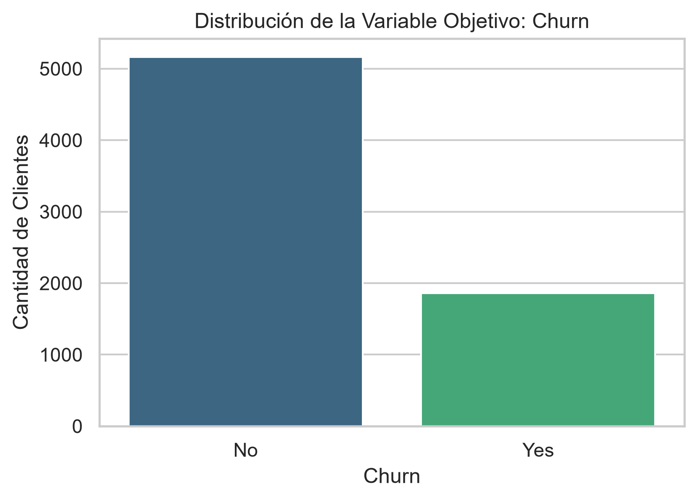
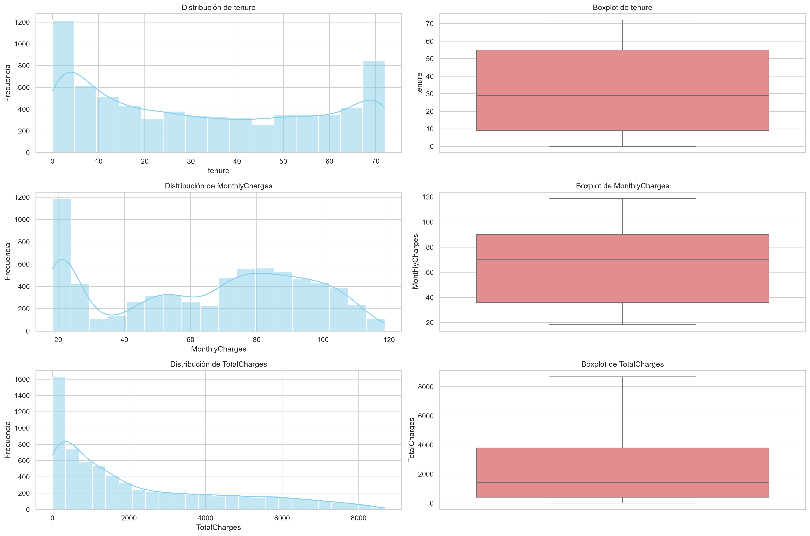
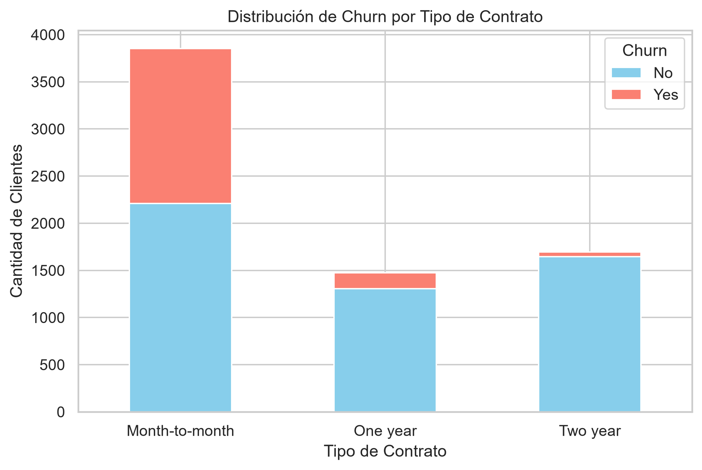

# Informe Ejecutivo: Prediccion de Fuga de Clientes

**Asignatura:** Machine Learning (MLY1101)  
**Caso:** Telco Customer Churn  
**Tipo de problema:** Clasificacion supervisada binaria  
**Metodologia:** CRISP-DM  
**Fecha:** Septiembre de 2026

## Resumen Ejecutivo

Este proyecto desarrolla una solucion de Machine Learning para identificar clientes de una empresa de telecomunicaciones con mayor probabilidad de abandonar el servicio. El objetivo de negocio es apoyar acciones preventivas de retencion, priorizando a los clientes en riesgo antes de que cancelen.

El analisis se realizo en dos cuadernos: [01_EDA_y_Limpieza.ipynb](notebooks/01_EDA_y_Limpieza.ipynb) documenta la calidad de los datos, la limpieza y los patrones exploratorios; [02_Modelado_y_Evaluacion.ipynb](notebooks/02_Modelado_y_Evaluacion.ipynb) prepara las variables, entrena cuatro modelos, los compara y evalua el modelo seleccionado.

El dataset limpio contiene 7,021 clientes y 20 variables. La clase `Churn = Yes` representa el 26.45% de los registros, por lo que el problema presenta un desbalance relevante. Se compararon Regresion Logistica, Random Forest, Gradient Boosting y Support Vector Machine (SVM). Se selecciono SVM porque obtuvo el mayor `Recall` (`0.7715`), criterio coherente con el objetivo de detectar la mayor cantidad posible de clientes que podrian abandonar.

La solucion incluye como valor agregado una pipeline reutilizable en [src/pipeline.py](src/pipeline.py) y un script de entrenamiento en [src/train.py](src/train.py). Esta pipeline conserva las transformaciones junto con el modelo y reduce el riesgo de aplicar tratamientos distintos entre entrenamiento y prediccion.

## 1. Problema de Negocio

La fuga de clientes reduce los ingresos recurrentes y obliga a invertir nuevamente en adquirir clientes. La empresa necesita responder:

> ¿Que clientes presentan mayor riesgo de abandono y deben ser priorizados por el equipo de retencion?

La solucion propuesta no reemplaza la decision comercial. Entrega una priorizacion basada en datos para que la empresa pueda contactar primero a los clientes con mayor riesgo y evaluar posteriormente el resultado de cada intervencion.

## 2. Objetivos

### Objetivo general

Construir y evaluar un modelo que estime el riesgo de `Churn` de cada cliente usando variables demograficas, contractuales, de servicios y de facturacion.

### Objetivos especificos

1. Identificar la fuente de datos y organizar las herramientas del proyecto.
2. Revisar la calidad de los datos y corregir inconsistencias.
3. Explorar patrones relacionados con el abandono.
4. Preparar las variables para el modelamiento sin fuga de informacion.
5. Comparar varios modelos de clasificacion con metricas apropiadas para el negocio.
6. Seleccionar un modelo segun la prioridad de detectar clientes en riesgo.
7. Entregar una solucion reproducible y reutilizable mediante una pipeline.

## 3. KPIs y Criterios de Exito

### KPIs de negocio

| KPI | Proposito |
|---|---|
| Tasa de Churn | Medir el porcentaje de clientes que abandona en un periodo. |
| Clientes en riesgo contactados | Controlar la cobertura de la estrategia de retencion. |
| Efectividad de retencion | Medir cuantos clientes contactados permanecen despues de la intervencion. |
| Costo por intervencion | Controlar el presupuesto utilizado en ofertas y contactos. |
| Valor de vida protegido | Estimar el valor de los clientes retenidos. |

### Metricas de Machine Learning

- **Recall:** metrica principal. Mide cuantos clientes que realmente abandonan fueron detectados. Se prioriza para reducir falsos negativos.
- **Precision:** indica cuantos clientes marcados como riesgo efectivamente pertenecen a la clase positiva; ayuda a controlar el costo de falsos positivos.
- **F1-Score:** resume el equilibrio entre precision y recall.
- **ROC-AUC:** mide la capacidad general de ordenar clientes positivos y negativos a distintos umbrales.
- **Ganancia y Lift:** ayudan a decidir que porcentaje de la cartera conviene contactar primero.

## 4. Fuentes de Datos y Herramientas

### Fuente de datos

Se utilizo el dataset publico **Telco Customer Churn**, disponible en [Kaggle](https://www.kaggle.com/datasets/blastchar/telco-customer-churn), originalmente con 7,043 registros y 21 columnas. El archivo original se encuentra en `data/raw/WA_Fn-UseC_-Telco-Customer-Churn.csv` y el archivo procesado en `data/processed/teleco_clean.csv`.

### Herramientas utilizadas

- Python y Jupyter Notebook para el analisis reproducible.
- pandas y NumPy para manipulacion de datos.
- Matplotlib y Seaborn para visualizaciones.
- scikit-learn para transformaciones, modelos, validacion y metricas.
- imbalanced-learn para SMOTE.
- SHAP para explicabilidad aproximada.
- joblib para guardar el modelo.
- Git/GitHub y Visual Studio Code para versionado, colaboracion y organizacion del proyecto.

Las dependencias estan declaradas en [requirements.txt](requirements.txt), evitando que cada integrante instale manualmente librerias diferentes.

### Trazabilidad con la pauta de evaluacion

| Indicador | Evidencia en el proyecto |
|---|---|
| IE1: Fuentes y herramientas colaborativas | Fuente Kaggle documentada, datos locales organizados, Git/GitHub, VS Code y notebooks reproducibles. |
| IE2: Manipulacion y preparacion en Python | Limpieza con pandas, conversion de tipos, imputacion, eliminacion de duplicados y exportacion del CSV procesado. |
| IE3: Analisis exploratorio y calidad | `df.info()`, estadisticas descriptivas, distribucion del target, analisis categorico, boxplots, correlaciones y evidencias en `images/`. |
| IE4: Sesgos, etica y privacidad | Seccion de riesgos, mitigaciones, proteccion del identificador y limites de uso de las predicciones. |

Esta trazabilidad permite relacionar cada criterio de la evaluacion con un artefacto verificable y facilita la defensa tecnica individual.

## 5. Preparacion y Calidad de Datos

El cuaderno EDA realizo las siguientes acciones:

1. Cargo el CSV y reviso estructura, tipos, estadisticas y valores faltantes.
2. Elimino `customerID`, porque es un identificador y no una caracteristica generalizable.
3. Convirtio `TotalCharges` desde texto a variable numerica.
4. Interpreto los espacios vacios como valores faltantes.
5. Aplico la regla de negocio `tenure = 0` y `TotalCharges = 0`.
6. Imputo valores restantes de `TotalCharges` con la mediana.
7. Detecto y elimina duplicados exactos despues de retirar el identificador.
8. Exporto el resultado a `data/processed/teleco_clean.csv`.

Estas decisiones permiten que el modelado trabaje con datos numericos y completos, manteniendo una justificacion entendible para cada tratamiento.

## 6. Analisis Exploratorio de Datos

### Distribucion del objetivo

El dataset limpio contiene 5,164 clientes sin abandono (`73.55%`) y 1,857 con abandono (`26.45%`). Este desbalance explica por que la exactitud por si sola no es suficiente: un modelo podria acertar muchos casos de la clase mayoritaria y aun asi dejar sin detectar demasiados clientes en riesgo.

### Patrones relevantes para el negocio

- Los clientes con contrato `Month-to-month` concentran la mayor cantidad y proporcion de abandonos.
- El riesgo es mayor en clientes con baja antiguedad (`tenure` bajo), especialmente durante los primeros meses.
- `Fiber optic` presenta mayor proporcion de abandono que DSL y que quienes no tienen internet.
- Los clientes que abandonan tienden a presentar cargos mensuales mas altos.
- Los clientes que abandonan suelen tener cargos totales menores, coherente con una permanencia mas corta.
- `tenure` y `TotalCharges` presentan una relacion positiva fuerte, porque los clientes antiguos acumulan mas cargos.
- Servicios como `TechSupport` y `OnlineSecurity` muestran una relacion relevante con la permanencia y deben considerarse en acciones de retencion.

Los graficos y tablas que sustentan estos hallazgos se encuentran en [images/](images/).

### Lectura de las evidencias



La distribucion del objetivo muestra por que se prioriza Recall: la clase de abandono es minoritaria y un modelo que siempre predijera permanencia podria parecer exacto, pero seria poco util para retencion.



Los boxplots permiten comparar la antiguedad, los cargos mensuales y los cargos acumulados entre clientes que abandonan y que permanecen. Estas diferencias orientan la preparacion numerica y las hipotesis comerciales, pero no prueban que una variable sea la causa del abandono.



La comparacion por contrato transforma el hallazgo en una accion: los clientes `Month-to-month` requieren una estrategia de retencion diferenciada y un seguimiento temprano.

## 7. Transformacion y Modelamiento

El cuaderno de modelado divide los datos en entrenamiento y prueba con una proporcion 80/20 y estratificacion. La variable objetivo se codifica como `0 = No` y `1 = Yes`.

El preprocesamiento aplica:

1. `PowerTransformer` Yeo-Johnson a `tenure`, `MonthlyCharges` y `TotalCharges`.
2. `StandardScaler` a `SeniorCitizen`.
3. `OneHotEncoder(handle_unknown='ignore')` a las variables categoricas.
4. `SMOTE` dentro de cada pipeline de entrenamiento para tratar el desbalance.
5. `GridSearchCV` con cinco folds y `ROC-AUC` como criterio de busqueda.

La aplicacion de SMOTE dentro de la pipeline evita utilizar informacion sintetica del conjunto de prueba durante el entrenamiento.

### Secuencia de trabajo

El flujo sigue una progresion deliberada: primero se entiende el problema y se define el costo de no detectar un abandono; luego se revisa la calidad de los datos; despues se exploran patrones; a continuacion se transforman las variables y se balancea el entrenamiento; finalmente se comparan modelos y se traduce el resultado a una estrategia de priorizacion. Esta secuencia evita presentar una metrica aislada sin explicar para que decision sirve.

## 8. Resultados de los Modelos

Resultados obtenidos sobre el conjunto de prueba:

| Modelo | Exactitud | Precision | Recall | F1-Score | ROC-AUC |
|---|---:|---:|---:|---:|---:|
| Regresion Logistica | 0.7516 | 0.5218 | 0.7392 | 0.6118 | 0.8408 |
| Random Forest | 0.7609 | 0.5350 | 0.7392 | 0.6208 | 0.8381 |
| Gradient Boosting | 0.7858 | 0.5855 | 0.6532 | 0.6175 | 0.8416 |
| SVM | 0.7445 | 0.5116 | **0.7715** | 0.6152 | 0.8405 |

Gradient Boosting obtuvo el mejor rendimiento general en exactitud, precision, F1-Score y ROC-AUC en la ejecucion mas reciente. SVM obtuvo el mayor Recall, por lo que fue seleccionado bajo la prioridad de detectar abandonos y reducir falsos negativos.

### Matriz de confusion del criterio de seleccion

Para SVM se observaron `759` verdaderos negativos, `274` falsos positivos, `85` falsos negativos y `287` verdaderos positivos. Este resultado representa una mayor deteccion de clientes que abandonan, a cambio de contactar a mas clientes que finalmente permanecen.

### Validacion cruzada

Para el SVM seleccionado, la validacion cruzada obtuvo una media de ROC-AUC de `0.8473` y una desviacion estandar de `0.0058`. La baja variacion sugiere estabilidad entre las particiones evaluadas, pero debe confirmarse con nuevos datos antes de un uso productivo.

## 9. Interpretacion y Aplicacion de Negocio

El modelo debe utilizarse como un sistema de priorizacion, no como una sentencia automatica. La empresa puede ordenar clientes por probabilidad estimada, definir grupos de riesgo y asignar recursos de retencion de forma gradual.

Las curvas ROC y Precision-Recall muestran el comportamiento del modelo bajo distintos umbrales. Las curvas de Lift y Ganancia Acumulada permiten responder cuanto valor se concentra al contactar primero a un porcentaje de clientes. SHAP aporta explicaciones aproximadas para variables transformadas y casos individuales; no demuestra causalidad.

Recomendaciones:

- Priorizar clientes nuevos, con contrato mensual y cargos mensuales elevados.
- Revisar la experiencia y propuesta de valor asociada al servicio de fibra optica.
- Considerar servicios de soporte en ofertas de retencion.
- Elegir el umbral de contacto considerando Recall, precision, presupuesto y capacidad operativa.
- Medir retencion real mediante seguimiento o una prueba controlada, porque el analisis observacional no prueba que una oferta evite el abandono.

## 10. Sesgos, Etica y Privacidad

Este proyecto utiliza datos de clientes y puede afectar decisiones comerciales, por lo que requiere controles antes de desplegarse.

### Riesgos de sesgo

- Variables como `SeniorCitizen`, genero, dependientes y tipo de contrato pueden actuar como proxies de condiciones sociales o economicas.
- El dataset puede no representar a todos los clientes actuales ni a otras empresas o periodos.
- SMOTE equilibra la clase durante el entrenamiento, pero no elimina sesgos presentes en los datos originales.
- Un mayor Recall puede aumentar falsos positivos y provocar contactos comerciales innecesarios para determinados grupos.

### Medidas de mitigacion

- Comparar Recall, precision y tasas de error por segmento antes de usar el modelo.
- No utilizar la prediccion para negar servicios, aumentar precios o sancionar clientes.
- Revisar las variables utilizadas y retirar aquellas que no tengan justificacion comercial o tecnica.
- Mantener supervision humana para las acciones de retencion.
- Evaluar el impacto real con grupos de comparacion y monitorear cambios en el tiempo.

### Privacidad y uso responsable

- `customerID` se elimina porque no aporta valor predictivo y reduce la exposicion de identificadores.
- El acceso a datos y modelos debe limitarse a personas autorizadas.
- Los archivos deben almacenarse en ubicaciones controladas y utilizarse solo para el objetivo informado.
- En un escenario real se deben aplicar las politicas institucionales y la normativa vigente de proteccion de datos.
- Las explicaciones del modelo deben comunicarse de manera comprensible y no presentarse como causas definitivas del abandono.

## 11. Pipeline Reproducible: Valor Agregado

La pipeline de [src/pipeline.py](src/pipeline.py) integra en un mismo flujo:

- Limpieza de `customerID`, valores vacios y `TotalCharges`.
- Imputacion de valores faltantes.
- Transformacion Yeo-Johnson.
- Estandarizacion de `SeniorCitizen`.
- Codificacion One-Hot.
- SMOTE aplicado solo durante el ajuste.
- Clasificador SVM con probabilidades.

Esto agrega valor porque el modelo guardado conserva las transformaciones necesarias para procesar nuevos clientes de la misma forma. Tambien reduce el riesgo de fuga de datos frente a ajustar transformaciones fuera de la validacion cruzada.

## 12. Ejecucion Reproducible

Desde la raiz del proyecto, en PowerShell:

```powershell
python -m venv .venv
.\.venv\Scripts\Activate.ps1
python -m pip install --upgrade pip
python -m pip install -r requirements.txt
python src\train.py
```

El entrenamiento imprime un reporte de clasificacion y ROC-AUC, y guarda el modelo en:

```text
models/telco_churn_pipeline.joblib
```

### Reproducibilidad y colaboracion

Una persona puede reproducir el proyecto desde un equipo limpio siguiendo los comandos anteriores. El uso de `requirements.txt` fija el conjunto de dependencias; los notebooks documentan el razonamiento y las evidencias; `src/` concentra la logica reutilizable; y Git/GitHub permite trabajar con historial de cambios, revisiones y una fuente comun para el equipo. Antes de la entrega se recomienda ejecutar ambos notebooks desde un kernel limpio y comprobar que los PNG esperados se regeneran en `images/`.

Para usar el modelo guardado:

```python
import joblib
import pandas as pd

model = joblib.load('models/telco_churn_pipeline.joblib')
new_customers = pd.read_csv('data/processed/teleco_clean.csv').drop(columns=['Churn'])
predictions = model.predict(new_customers)
probabilities = model.predict_proba(new_customers)[:, 1]
```

Para reproducir los notebooks, abrirlos desde la raiz del proyecto, seleccionar el entorno virtual `.venv` como kernel y ejecutar las celdas en orden. Las evidencias graficas se guardan en `images/`.

## 13. Evidencias del Proyecto

La carpeta [images/](images/) contiene las evidencias generadas por ambos cuadernos:

- `01` a `09`: EDA y limpieza.
- `10`: distribuciones numericas utilizadas para justificar las transformaciones.
- `11` a `14`: matrices de confusion de los cuatro modelos.
- `15` a `19`: validacion y evaluacion del SVM.
- `20` a `23`: explicaciones SHAP.
- `24` y `25`: curvas comparativas ROC y Precision-Recall.
- `26` y `27`: curvas de Lift y Ganancia Acumulada.

## 14. Limitaciones y Proximos Pasos

Los resultados representan el comportamiento del dataset analizado y no garantizan el mismo rendimiento en otros periodos o segmentos de clientes. El modelo identifica asociaciones predictivas, no causas. Ademas, el efecto de una campaña de retencion no fue medido en este proyecto, por lo que la efectividad del plan debe validarse con seguimiento y, de ser posible, un grupo de comparacion.

Los siguientes pasos recomendados son:

1. Validar el modelo con datos nuevos y revisar el rendimiento por segmento.
2. Definir un umbral de contacto usando costos reales de incentivos y capacidad operativa.
3. Medir la retencion obtenida mediante una prueba controlada.
4. Monitorear deriva de datos, cambios en la tasa de Churn y estabilidad de las explicaciones SHAP.
5. Revisar periodicamente el uso de variables sensibles y los posibles impactos diferenciados.

## 15. Estructura del Proyecto

```text
data/
|-- raw/
`-- processed/
images/
models/
notebooks/
|-- 01_EDA_y_Limpieza.ipynb
`-- 02_Modelado_y_Evaluacion.ipynb
src/
|-- __init__.py
|-- pipeline.py
`-- train.py
requirements.txt
README.md
```

## 16. Conclusiones

El proyecto cumple el flujo de CRISP-DM: comprende el problema, identifica la fuente, prepara los datos, explora patrones, transforma variables, compara modelos y propone una aplicacion de negocio. El hallazgo central es que el abandono se concentra especialmente en clientes nuevos y con contratos mensuales, mientras que el modelo SVM permite detectar una mayor proporcion de abandonos que las alternativas evaluadas.

La pipeline modular constituye un valor agregado para transformar el trabajo exploratorio en una solucion reproducible. Antes de implementarla en produccion se debe validar con datos nuevos, revisar metricas por segmento, definir un umbral comercial y medir el impacto real de las campanas de retencion.
